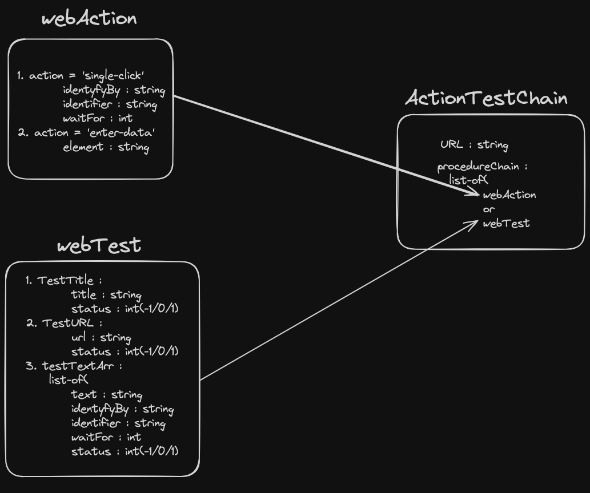

A single page automation using `selenium` and use use it as validation in `chrome` webdriver. To run the code:

```
python  main.py --debug --showTest
```

**Below is the object model:**


Lets go through the objects data one by one:

---
### webAction

-  defined in [utils.py](./utils.py)  
- Indicating the user intraction to the webPage. We have only consider two simple operation i.e. `single-click` and `enter-data` for keyboard input. 
- 1. To identify-By(`identyfyBy`) the a html element from 
    ```
    ['id', 'name', 'xpath', 'link_text', 'partial_link_text', 'tag_name', 'class_name', 'css_selector']
    ```
  2.  The unique way wrt the `identyfyBy`  
  3. `waitFor` an integer value which wait for element to be visible for a given time.
- 1. enter-data takes in string element. But note the object should also be created after webAction of  `single-click` 

---
### webTest
- defined in [utils.py](./utils.py)
- For now three method for validation/testing is done. Each object have `status` which takes from values from 

    ```
    -1: failed
    0: not started
    1: success
    ```    
- test URL for checking url to given string
- test title for checking title to given string
- to check a html text data field of a given html object should be same as `webAction:single-click`

---
### ActionTestChain

- defined inside [page.py](./page.py)
- it takes `url` for creating the session
- and a list of `webAction` and `webTest`

### [crwaler.py](./crwaler.py)
- its where magic happens, initialize the chrome driver.
- goto the perticular url
- and perform the web action and testing wrt the `procedureChain` 